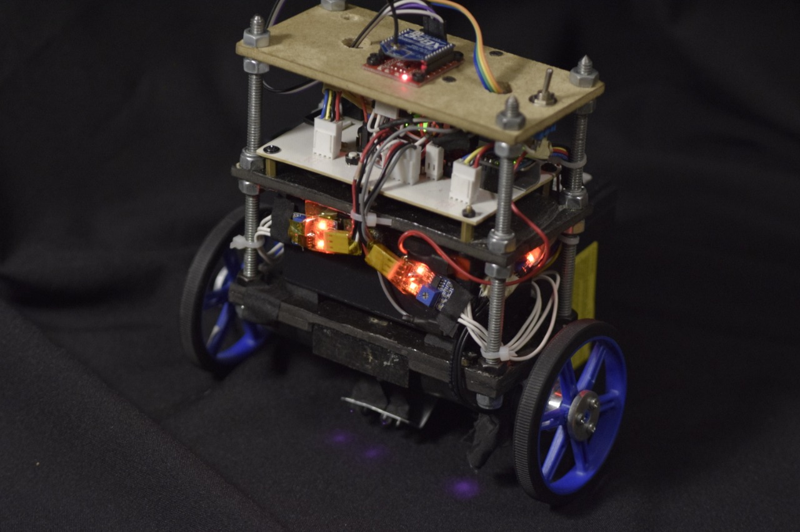
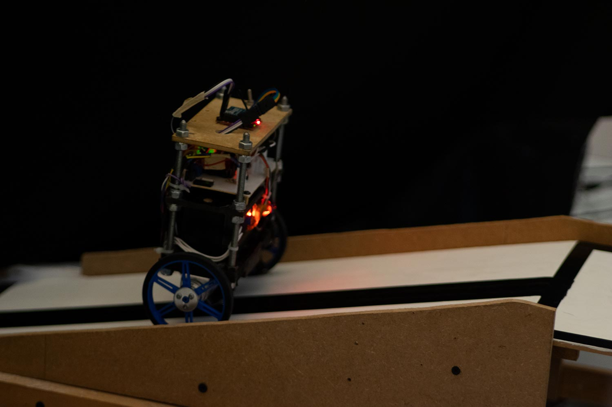
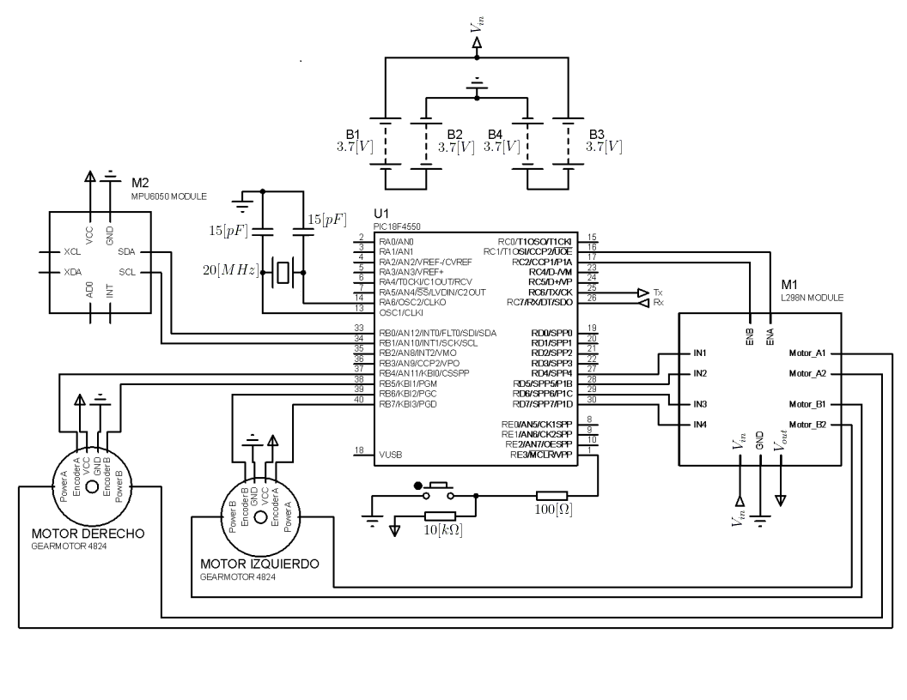

<h2 align="center">
    Self-Balancing Robot using PIC184550 by PC communication
</h2>

#### Summary

***

Build, instrument and control a line-following self-balancing robot that climbs slopes of 15 degrees of inclination with a Microchip ***PIC18F4550*** programmed in **[PIC C Compiler](https://www.ccsinfo.com/ccsfreedemo.php)**, use a ***MPU6050*** sensor to measure the inclination, where the position and speed controller run in **[Dev-C++](https://bloodshed.net/)** on a laptop with wireless communication.

  

  

  

#### Schematic

***

The projects was build using the next materials:

- PIC18F4550 microcontroller.
- L298N module.
- MPU6050 sensor.
- Pololu motor (item-4824).
- *XBee Series 1*

  

#### Source Codes

***

- **PIC18F4550_Balancin.c** contains all the methods and main function to execute the position and speed control in both motors.
- **MPU6050.c** contains the methods and defines to interface with the sensor.
- **ComunicacionBalancin.cpp** is executed in *Dev-C++* and make do math for position and speed controller.
